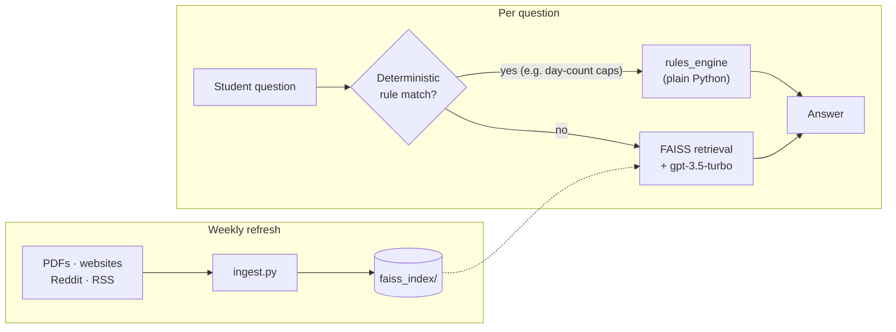

# 🎓 F1rstAid

A smart assistant for F-1 students navigating U.S. immigration regulations, powered by AI.

## 🌟 Features

- **Intelligent Q&A**: Get accurate answers about:
  - F-1 Visa requirements and maintenance
  - OPT/CPT applications and regulations
  - STEM OPT extensions
  - Employment authorization (Form I-765)
  - Travel and re-entry procedures

- **Multi-Source Knowledge**:
  - Official government documents (USCIS, ICE)
  - University guidelines
  - Community experiences (Reddit)
  - Regular updates to stay current

- **Smart Search**: 
  - Vector-based similarity search using FAISS
  - OpenAI embeddings for accurate retrieval
  - Context-aware responses

## 🗺️ Architecture



Most questions are answered by retrieval + the LLM. A small set of exact, arithmetic questions (like OPT unemployment day caps) are routed to deterministic Python instead, so the answer is computed rather than guessed. The knowledge base itself refreshes weekly from PDFs, official websites, Reddit, and RSS feeds.

## 🛠️ Installation

1. **Clone the Repository**
```bash
git clone https://github.com/yourusername/f1rstaid.git
cd f1rstaid
```

2. **Set Up Virtual Environment**
```bash
python -m venv venv
source venv/bin/activate  # For Mac/Linux
```

3. **Install Dependencies**
```bash
pip install -r requirements.txt
```

4. **Configure Environment Variables**
```bash
# Create .env file
touch .env

# Add your API keys
echo "OPENAI_API_KEY=your_key_here" >> .env
echo "REDDIT_CLIENT_ID=your_client_id" >> .env
echo "REDDIT_CLIENT_SECRET=your_client_secret" >> .env
echo "REDDIT_USER_AGENT=f1rstaid:v1.0" >> .env
```

## 🚀 Usage

1. **Start the Application**
```bash
streamlit run f1rstaid.py
```

2. **Update Knowledge Base**
```bash
python update_knowledge.py
```

3. **Run Web Crawler** (Optional)
```bash
python crawler/crawler.py
```

## 📁 Project Structure

```
f1rstaid/
├── f1rstaid.py          # Main application
├── ingest.py            # Document processing
├── update_knowledge.py  # Knowledge base updater
├── config/
│   ├── reddit_config.py # Reddit API configuration
│   └── sources.py       # Source URLs configuration
├── crawler/
│   └── crawler.py       # Web crawler
├── docs/                # PDF documents
└── logs/                # Application logs
```

## 📊 Monitoring & Logs

- **Application Logs**: `f1rstaid.log`
- **Ingestion Logs**: `ingest.log`
- **Crawler Logs**: `crawler/logs/crawler.log`

## 🔧 Development

### Running Tests
```bash
python -m pytest tests/
```

### Code Quality
```bash
# Run linter
ruff check .

# Format code
ruff format .
```

## 🧪 Testing

### Running Tests
```bash
# Install test dependencies
pip install -r requirements.txt

# Run all tests
python -m pytest

# Run with coverage report
python -m pytest --cov=. tests/

# Run specific test file
python -m pytest tests/test_f1rstaid.py
```

### Test Structure
- `test_f1rstaid.py`: Core application tests
- `test_ingest.py`: Document processing tests
- `test_crawler.py`: Web crawler tests
- `test_update_knowledge.py`: Knowledge base update tests

## 🤝 Contributing

1. Fork the repository
2. Create your feature branch (`git checkout -b feature/AmazingFeature`)
3. Commit your changes (`git commit -m 'Add some AmazingFeature'`)
4. Push to the branch (`git push origin feature/AmazingFeature`)
5. Open a Pull Request

## 📜 License

This project is licensed under the GNU General Public License v3.0 - see the [LICENSE](LICENSE) file for details.

### What this means:
- ✅ You can freely use, modify, and distribute this software
- ✅ You must disclose source code of any modifications
- ✅ You must license any derivative works under GPL-3.0
- ✅ Changes must be documented
- ❗ Any modifications must also be open source

## 🙏 Acknowledgments

- OpenAI for GPT models and embeddings
- LangChain for the language model framework
- FAISS for vector similarity search
- Streamlit for the web interface

## 📧 Contact

Your Name - [@haramrit09k](https://twitter.com/haramrit09k)

Project Link: [https://github.com/haramrit09k/f1rstaid](https://github.com/haramrit09k/f1rstaid)