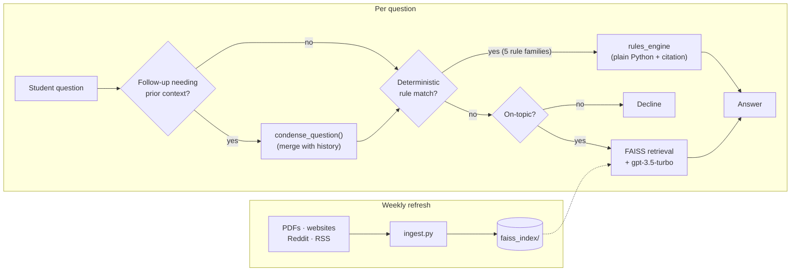

# 🎓 F1rstAid

A smart assistant for F-1 students navigating U.S. immigration regulations, powered by AI.

**Live demo**: [f1rstaid-064025a9fcc1.herokuapp.com](https://f1rstaid-064025a9fcc1.herokuapp.com/) — try it free (a few questions on a shared key), or bring your own OpenAI key for unlimited use.

## 🌟 Features

- **Deterministic answers where exactness matters**: five rule families (OPT/STEM-OPT unemployment day caps — including exact deadline dates, the 60-day grace period, the H-1B cap-gap extension, STEM Designated Degree List eligibility, and the 10-day SEVIS address-change deadline) are computed in plain Python instead of guessed by an LLM, each backed by a citation verified against a real, already-ingested source — not recalled from memory.
- **Real conversation memory**: follow-up questions ("what about STEM OPT?", or answering a clarifying question the assistant just asked) are understood in context, without needing to repeat yourself.
- **Honest about what it doesn't know**: a dedicated abstain state (distinct from "off-topic" and from a computed answer) when retrieved sources don't actually support a confident answer — no answer is better than a wrong one for a legal-adjacent topic.
- **Multi-source knowledge base**: official government documents (USCIS, DHS/Study in the States), university guidance, and Reddit community experiences (weighted below official sources, shown separately, and refreshed weekly).
- **Cost-protected**: a shared trial key lets anyone try the app free (rate-limited per session and per day); bringing your own key removes the limit.
- **User feedback loop**: 👍/👎 on every answer; a 👎 with a comment can file a GitHub issue automatically (rate-limited, and the original question is never included — this repo is public).
- **Freshness transparency**: the UI shows when the knowledge base was actually last refreshed, so a recent policy change isn't silently assumed to be included.

## 🗺️ Architecture



Most questions are answered by retrieval + the LLM. A narrow set of exact, arithmetic/lookup questions are routed to deterministic Python instead, so the answer is computed and cited rather than guessed. Follow-up questions are first merged with conversation history when needed. The knowledge base itself refreshes weekly from PDFs, official websites, Reddit, and RSS feeds.

## 🛠️ Installation

1. **Clone the Repository**
```bash
git clone https://github.com/haramrit09k/f1rstaid.git
cd f1rstaid
```

2. **Set Up Virtual Environment**
```bash
python -m venv venv
source venv/bin/activate  # For Mac/Linux
```

3. **Install Dependencies**
```bash
pip install -r requirements.txt
```

4. **Configure Environment Variables**
```bash
# Create .env file
touch .env

# Add your API keys
echo "OPENAI_API_KEY=your_key_here" >> .env
echo "REDDIT_CLIENT_ID=your_client_id" >> .env
echo "REDDIT_CLIENT_SECRET=your_client_secret" >> .env
echo "REDDIT_USER_AGENT=f1rstaid:v1.0" >> .env

# Optional: only needed to enable the thumbs-down -> GitHub issue feature
echo "GITHUB_TOKEN=your_fine_grained_pat" >> .env
```

## 🚀 Usage

1. **Start the Application**
```bash
streamlit run f1rstaid.py
```

2. **Update Knowledge Base**
```bash
python update_knowledge.py
```

3. **Run Web Crawler** (Optional)
```bash
python crawler/crawler.py
```

## ☁️ Deployment

Deployed on Heroku (`Procfile`, `.python-version`). Weekly knowledge-base refreshes and the test suite both run via GitHub Actions (`.github/workflows/`).

```bash
git push heroku main
```

## 📁 Project Structure

```
f1rstaid/
├── f1rstaid.py           # Streamlit app: chat UI, RAG chain, conversation memory, rate limiting
├── rules_engine.py       # Deterministic rule families for exact/citable answers
├── ingest.py             # Document processing
├── update_knowledge.py   # Knowledge base updater (writes freshness metadata)
├── config/
│   ├── reddit_config.py  # Reddit API configuration
│   └── sources.py        # Source URLs configuration
├── crawler/
│   └── crawler.py        # Autonomous URL-discovery web crawler
├── eval/
│   ├── dataset.json      # Eval question set (facts, eligibility, timeline math, edge cases)
│   ├── run_eval.py       # Eval harness -- scores against the live pipeline
│   └── results/          # Accuracy history over time, tagged to git commits
├── docs/                 # PDF source documents
└── .github/workflows/    # CI (tests) + weekly knowledge-base refresh
```

## 📊 Monitoring & Logs

- **Application Logs**: `f1rstaid.log`
- **Ingestion Logs**: `ingest.log`
- **Crawler Logs**: `crawler/logs/crawler.log`

## 📈 Evaluation

An offline eval harness scores the live pipeline against a fixed, categorized question set (factual lookups, multi-condition eligibility, timeline math, adversarial edge cases, out-of-scope questions), tracking accuracy over time against the git commit that produced it.

```bash
python eval/run_eval.py --label my-change
```

See `eval/README.md` for methodology, and `eval/results/history.jsonl` for the accuracy trend.

## 🔧 Development

### Running Tests
```bash
# Fast, free -- excludes tests that hit real external APIs
python -m pytest -m "not live"

# Full suite, including live API calls (needs real credentials)
python -m pytest
```

See `pytest.ini` for the `live` marker.

### Code Quality
```bash
# Run linter
ruff check .

# Format code
ruff format .
```

## 🤝 Contributing

1. Fork the repository
2. Create your feature branch (`git checkout -b feature/AmazingFeature`)
3. Commit your changes (`git commit -m 'Add some AmazingFeature'`)
4. Push to the branch (`git push origin feature/AmazingFeature`)
5. Open a Pull Request

## 📜 License

This project is licensed under the GNU General Public License v3.0 - see the [LICENSE](LICENSE) file for details.

### What this means:
- ✅ You can freely use, modify, and distribute this software
- ✅ You must disclose source code of any modifications
- ✅ You must license any derivative works under GPL-3.0
- ✅ Changes must be documented
- ❗ Any modifications must also be open source

## 🙏 Acknowledgments

- OpenAI for GPT models and embeddings
- LangChain for the language model framework
- FAISS for vector similarity search
- Streamlit for the web interface

## 📧 Contact

Your Name - [@haramrit09k](https://twitter.com/haramrit09k)

Project Link: [https://github.com/haramrit09k/f1rstaid](https://github.com/haramrit09k/f1rstaid)
